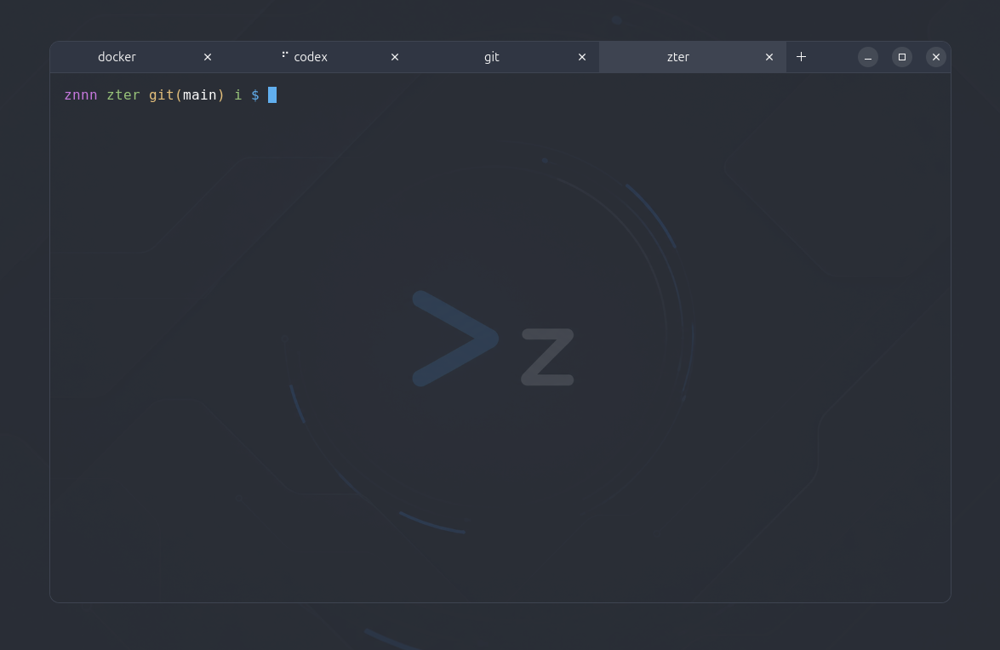
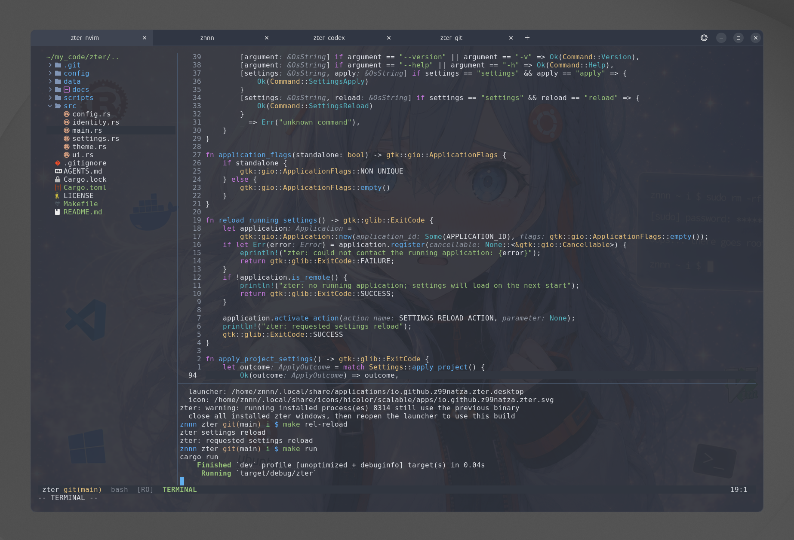

# zter

```text
- Date format Y-m-d
- Project created at 2026-08-24
- README.md updated at 2026-09-04
- Developed on Ubuntu
```




## Installation

```bash
# Rust/Cargo
sudo apt install curl
curl --proto '=https' --tlsv1.2 -sSf https://sh.rustup.rs | sh
source "$HOME/.cargo/env"

# Ubuntu dependencies 
sudo apt install build-essential pkg-config libgtk-4-dev libvte-2.91-gtk4-dev

```

## Run | [More...](docs/run.md)

```bash
# Clone
git clone https://github.com/Z99NATZA/zter.git
cd zter

# Run
cargo run
```

## (Optional)

```bash
# Apply current settings
cargo run -- settings apply
cargo run -- settings reload

# Standalone
cargo run -- -s

# Version
cargo run -- -v
```

## Documentation

- [Settings](docs/settings.md)
- [Terminal runtime](docs/terminal-runtime.md)
- [Desktop integration](docs/desktop-integration.md)

## MIT [LICENSE](LICENSE)
